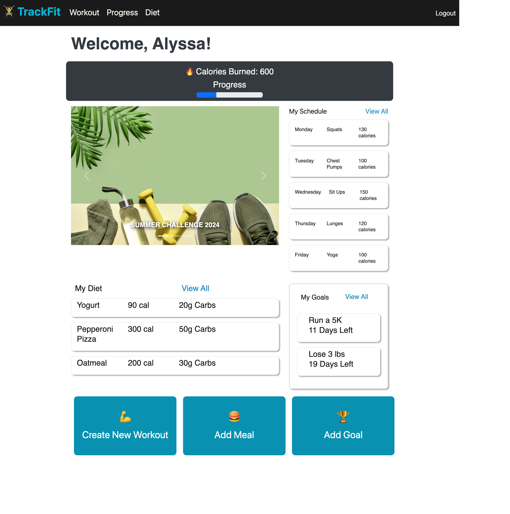

# TrackFit

## Table of Contents

- [Description](#description)
- [Demo](#demo)
- [Installation](#installation)
- [Usage](#usage)
- [Resources](#resources)
- [Contributors](#contributors)
- [License](#license)

## Description

Our web application, Trackfit, is a fitness application that allows users to plan workouts and track meals so that they can meet their fitness goals. Users can add workouts to their schedule and track if they’ve completed them. They can also add meals they’ve eaten to see if they’ve reached their calorie or carb count.

Features:

- Navigation: Simple and intuitive navigation bar for easy access to different sections of the website.
- Workout Scheduler: User can input workouts that they want to do for the week
- Meal Input: User can input meals and calories consumed

Technologies Used:

- Languages: JavaScript HTML, CSS
- Data Query: GraphQL with a Node.js and Express.js server
- UserInterface: React
- Database: Mongo DB
- CSS Framework: Bootstrap

## Demo

Link to deployed application: https://immense-savannah-94600-01fc64ff673b.herokuapp.com/

## Installation

To install this project you can either perform a `git clone` in your command-line or simply fork your own copy into your Github.

## Usage

To use this project,

1.  Go to the cloned files, then type `npm i` in your terminal to install the appropriate dependencies. Be sure you’re in the correct location in your terminal first!
2.  Populate the database by running `npm run seed`
3.  Start the application by running `npm run develop`
4.  Or you can visit the deployed application here: https://immense-savannah-94600-01fc64ff673b.herokuapp.com/

## Resources

https://getbootstrap.com/docs/5.0/getting-started/introduction/

https://graphql.org/learn/schema/

https://www.apollographql.com/docs/react/

https://react.dev/

## Contributors

[Joshua Jacob](https://github.com/joshjac16)
[Nelly Lopez](https://github.com/nlopez39)
[Aileen Nguyen](https://github.com/nguyenaileen)

## License

